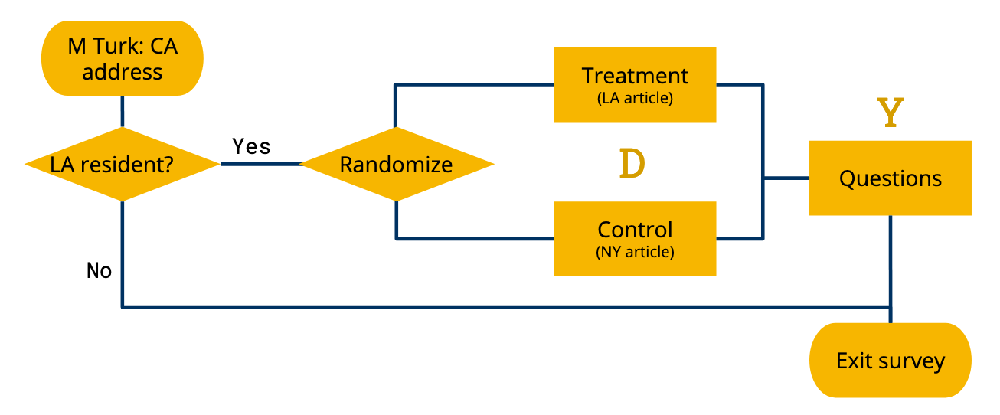

Speaking Science
================
Aris Fotkatžikis, Haerang Lee, Mumin Khan

  - [Executive Summary](#executive-summary)
  - [Introduction](#introduction)
  - [Experimental Design](#experimental-design)
      - [Narrowing Down the Question](#narrowing-down-the-question)
      - [Choosing the Article](#choosing-the-article)
      - [Treatment](#treatment)
      - [Power Analysis & Outcome](#power-analysis-outcome)
          - [Reading Comprehension](#reading-comprehension)
          - [Donation as an Action](#donation-as-an-action)
          - [Article Reading Time](#article-reading-time)
  - [Final Research Methodology](#final-research-methodology)
      - [Participant Recruitment and
        Randomization](#participant-recruitment-and-randomization)
      - [Outcome Measurement](#outcome-measurement)
  - [Exploratory Data Analysis (EDA)](#exploratory-data-analysis-eda)
  - [Results](#results)
      - [Compliance & Attrition](#compliance-attrition)
      - [Regression Results](#regression-results)
  - [Generalizability Concerns](#generalizability-concerns)
      - [Science Communication Field](#science-communication-field)
      - [Comprehension is Difficult to
        Quantify](#comprehension-is-difficult-to-quantify)
      - [Competing Incentives with Mechanical
        Turk](#competing-incentives-with-mechanical-turk)
  - [Conclusion](#conclusion)

# Executive Summary

In this experiment, we examine whether the proximity to the location
discussed in a science news article affects the reader’s engagement with
the article and its topic. The treatment group scored slightly better
than the control group and tended to think that the issue discussed was
more important. However, treatment and control did not show a
significant difference in the article reading time, the donation toward
the cause discussed in the article, or the rating of the article’s
credibility. In addition to the analysis, we also discuss the experiment
design process and thoughtful data collection to maximize the chance
that we detect any real treatment effects.

# Introduction

Well-written science news spurs interest in the topic and inspires
actions. One might expect a well-informed article on diabetes to compel
readers to eat healthier. The news about the wonders of Mother Nature
may inspire children to pay closer attention to the trees when they
hike, to visit museums more, or perhaps even pursue a career in science.
We started with the question of how effective science communication
could increase the public’s engagement with science.

While an examination of long-term engagements would have been ideal, we
were strapped for resources. Then, we remembered a recent news article
about how the rising sea levels may change the landscape of the Bay
Area, where we live. It had compelled us to research the topic and
become knowledgeable about how to change our behaviors to alleviate
climate change. For this study, our research question focuses instead on
the very first step of the long-term engagement: **Does the locality of
a scientific article impact the reader’s engagement with the issue
discussed in the article?**

We recruited survey respondents from Los Angeles. We showed them an
article that discussed air pollution caused by commercial ships visiting
the regional ports. For those in the treatment group, the article
referred to Los Angeles, and for those in the control group, the article
referred to New York.

After they had read the articles, we asked them questions to collect the
following outcomes.

1.  Reading comprehension quiz score (0 - 6 points)
2.  Donation amount toward alleviating air pollution, if they won a $100
    raffle from this survey
3.  Article reading time
4.  Rating of importance of the air pollution issue
5.  Rating of credibility of the article

We hypothesize that a locally-related topic would make people read the
article more carefully and understand more of it. The implications of
the results would mean that the science communities that hope to engage
more people should target local communities.

# Experimental Design

## Narrowing Down the Question

The most challenging part of our journey was to crystallize the research
question. We could have operationalized the concept of engagement in
myriad ways: future college majors in a scientific discipline; museum
visits; the likelihood of creating a vinegar volcano with kids at home;
or eco-friendly product consumption.

In the first iteration of our research design, we considered testing
whether the jargon and the author of a tweet would change the
click-through rate (CTR). However, we did not believe that clicking on a
link necessarily indicated an intrinsic fascination with science or
signaled a long-term effect.

We reached out to a contact at the Lawrence Berkeley National
Laboratory, Tim Hurt, who develops science education curriculums. He
shared some surveys that his team used to measure students’ interest or
fascination with science. We considered using a modified version of this
survey, which would have given us a self-reported level of engagement.
However, we did not believe that a feeling of engagement with science
would change within the short timeframe of our research. Finally, only
after spending a long time exploring two utterly different research
questions, we arrived at the idea of measuring the impact of local news
on engagement.

## Choosing the Article

We gave careful considerations to the topic, which could influence the
outcome. For instance, a divisive topic such as climate change could
impact the engagement of a subset of the readers with a particular
political affiliation and violate the excludability assumption. On the
other extreme, a highly esoteric topic could fail to engage a majority
of our readers. After some discussion, we determined that pollution and
its impact on people’s lives could be neutral and relatable enough for
the study.

In our first pilot study, we discovered more variables that affected the
outcome. All of the respondents scored 100% on the reading comprehension
quiz, because the article was too short and easy. The lack of variance
implied that any existing treatment effect would be hard to detect. So
we picked a new article that was longer and made the quiz harder.

Our article of choice was about large ships contributing to air
pollution. We recruited participants from LA and used Qualtrics features
to randomly assign treatment by the individual. The treatment group was
given the article with references to LA. In contrast, the control group
was given the same article with references to New York, because New York
was a coastal city with a similar population as LA and had large ports
that the article could be about.

## Treatment

The treatment is the locality of the article. We originally wanted to
compare the effect of an article set in the reader’s city, compared to a
broader region like the country or even the world. The comparison
between a city and a broader region may have been possible if we could
have a bank of news articles, from which we could randomly select and
give to each survey respondent. Such a design would require a large
number of articles to control for other variables that may affect the
outcome, including the source, topic, and diction.

Due to the limited resources we had, we wanted to stick to a single
article in which the location keywords would be the only difference
between treatment and control. Unfortunately, we could not exchange the
name of a city for a state, country, or the world without completely
changing the contents of the sentence and the article. So we changed the
control variable to represent a remote city.

## Power Analysis & Outcome

### Reading Comprehension

We hypothesized that if a participant finds an article more interesting
because it is related to their immediate residential environment, then
they would read it more closely and retain more of the information. To
measure the information retention, we designed a 6-question quiz and
used quiz scores as an outcome variable representing engagement, fully
recognizing the following limitations to this measurement. First, this
methodology assumes that the quiz performance is an accurate
representation of the comprehension, which is likely false. Second, the
methodology treats the score as a continuous variable, although one’s
comprehension is not on a linear scale.

After conducting the second pilot study, we studied the results and made
a subjective determination that the true distribution might look like
the following.

Assuming that the above represents the true distribution, the power
analysis indicated that we would need at least 100 respondents to
achieve a power of 90%. *(Note: Due to the random nature, the minimum
sample size may change, but it’s generally in the 100-120 range.)*

### Donation as an Action

We were interested in whether the treatment could compel the subjects to
take action in real life. We measured the behavior by asking people to
donate real currency toward the cause discussed in the article. We
entered every survey participant in a raffle to win $100 and asked how
much of the raffle winnings the respondent would like to donate toward
alleviating air pollution. We stated that we would donate this amount on
their behalf and award them the rest, should they win the raffle. This
question forced people to put the money where their mouth was, rather
than merely proclaiming that they cared. We hypothesized that the
treatment group would be more engaged with the topic in the article and
donate more toward the cause.

We were not sure what the actual distribution of donation amounts might
look like. We tried two different assumptions and the power analysis
indicated that either 100 observations would be enough or 700 would be
insufficient to achieve the power of 90%. However, our budget did not
allow us to collect more than 200 samples. In conclusion, we are
uncertain that we will have enough power to detect any real treatment
effects in the donation amounts in this study.

### Article Reading Time

For a long article of 1,300 words, compliance was a concern. However, in
real life, we wouldn’t expect most people to read the whole article.
Since the location was indicated in the title of the article, we decided
to think of that as the treatment and see how the reading time changes
in response.

For the power analysis, we took the average article reading time from
the pilot, but reduced the standard deviation from the pilot by 20%,
taking into account a larger sample size we will collect from the full
study. As a result, we calculated that 100 observations is sufficient to
achieve a power of 90%.

# Final Research Methodology

## Participant Recruitment and Randomization

Mechanical Turk only allowed us to filter the workers by the state. We
recruited 200 survey respondents from Amazon Mechanical Turk in
California. In order to filter workers by those living in LA, we
instructed the workers to accept the task only if they lived in LA.
Additionally, the first question on Qualtrics asked whether the
respondent lived in LA and if they didn’t, they exited the survey. As a
result, all self-identifying LA residents were randomly assigned
treatment or control, then given a series of questions.

Survey Flow

## Outcome Measurement

In conclusion, we measured the following five outcomes and compared the
difference between the treatment and control groups to find the
treatment effect, as shown in the diagram below.

1.  Quiz score
2.  Donation amount
3.  Article reading time
4.  Rating of importance of the issue
5.  Rating of credibility of the article

In order to ensure a high quality response, we have communicated to the
survey takers that they please read as they normally would read any
other article and they do not cheat on the questions.

Treatment and Randomization

# Exploratory Data Analysis (EDA)

A total of 264 people clicked on our survey on Mechanical Turk. 64
people did not complete the survey. Out of the 200 who completed the
survey, we dropped 6 people, either due to missing quiz answers or
because they stated that they were not LA residents. We did not exclude
the 40 people whose IP address was from outside of CA, because they may
be traveling. In the end, we had 97 people in treatment and 97 in
control. See graphical representation of survey participants below.

Sankey Diagram of survey data

We decided to use relatively hard questions in the reading comprehension
quiz, to ensure that only people who paid attention to the article would
score high. The number of correct responses per question is shown in
Figure 8. It is evident that some questions were more difficult than
others.

Figure 9 shows the histogram of the quiz scores, which resembles our
assumed distribution at the power analysis steps, except that not a
single respondent out of the final 196 observations scored 6 out of 6.
The mean score of the treatment group was 2.76 and that of the control
group was 2.33.

The distribution of the article reading time, Figure 10, revealed that
our assumption of normal distribution was incorrect. Although the
article is 1,300 words and would take a very fast reader (200 words per
minute) 7 minutes to read, about 30% of our respondents are spending
less than a minute and 40% under 2 minutes. The difference between
treatment and control is only 10 seconds, as opposed to 70 seconds we
thought we would see.

The actual distribution of donation amounts, Figure 11, seems to have a
much smaller treatment effect than either one of our assumed
distributions at the time of the power analysis, shown in Figure 3.
Since our “worse case model” required more than 800 observations and
this distribution seems to indicate even smaller (if any) treatment
effect, we are doubtful we will detect any treatment effects here.

We examined the distribution of article reading time (Figure 12, left)
and donation amount (Figure 12, right) per quiz score. Unsurprisingly,
those who spend more time to read the article perform better on the
quiz. On the other hand, those that performed better on the quiz, and
therefore those we predicted to take more action in real life, tended to
donate less toward the cause. It might indicate that the more effort
people put in reading and answering the questions, the less they were
inclined to donate their hard-earned money.

We asked the participants to rate the topic importance and article
credibility on a scale of 1 to 7 (Figure 13.) On the right, credibility
seems similar between treatment and control. On the left, treatment
tends to assign higher importance ratings than control. According to the
Wilcoxon rank-sum test, this difference in importance rating is
statistically significant at the 0.05 level, in accordance with our
hypothesis.

    ## 
    ##  Wilcoxon rank sum test with continuity correction
    ## 
    ## data:  d$importance[d$treatment == 0] and d$importance[d$treatment == 1]
    ## W = 3969.5, p-value = 0.04491
    ## alternative hypothesis: true location shift is not equal to 0

    ## 
    ##  Wilcoxon rank sum test with continuity correction
    ## 
    ## data:  d$credibility[d$treatment == 0] and d$credibility[d$treatment == 1]
    ## W = 4391, p-value = 0.2686
    ## alternative hypothesis: true location shift is not equal to 0

# Results

## Compliance & Attrition

We were surprised by how little time many of our respondents spent
reading the article. We had anticipated a bell-curve distribution of
article reading times but, instead, observed a highly right-skewed
distribution (Figure 14). The participants recruited through Mechanical
Turk prefer to spend as little time on each task as possible and this
preference is evident in their behaviors.

Although the participants who spend little time on the article are
unlikely to have read it thoroughly, we decided not to filter based on
these values. People vary their reading behaviors when they interact
with journalistic writings in real life, such as skimming or only
reading the first sentences. Therefore, we did not want to impose an
arbitrary threshold on the article reading time. Instead, we excluded
those participants who took fewer than 100 seconds to answer the
questions that followed the reading. We arrived at the threshold of 100
seconds by dividing the total number of words in the questions section
(340 words) by a fast reading speed of 200 words per minute. The result
is a dataset of 113 observations, 63 in control and 50 in treatment. We
felt comfortable excluding observations by a reading time threshold,
because treatment and control did not show a statistically significant
difference in the article reading time. And while we had high attrition,
we believe that it affected both control and treatment groups equally as
a result of random assignment. Therefore, we exclude the attritors from
the analysis and believe that doing so will not bias our results.

## Regression Results

A simple regression of our three outcome variables yields the following
table.

As shown, we observed a treatment effect of 0.645 with a p-value of
0.014 for the number of questions the survey taker answered correctly
when treated. This hints that respondents who received the local (Los
Angeles) article paid more attention to its contents and were able to
recall information better on the quiz. Unfortunately, the same cannot be
said about our article reading time outcome variable (ATE = 30.599,
p=0.329) or our donation amount outcome variable (ATE = -3.603,
p=0.509).

When considering the effect of treatment on the number of questions a
respondent answered correctly, we wanted to make sure there were no
unobserved confounds contributing to the effect. After running several
analyses, the only significant covariate we found was the article
reading time. Taking it into account yields the regression below.

Each additional second of article reading time increases the quiz score
by 0.003 points, or 0.18 points per additional minute. Regardless of
this addition, the treatment effect is still statistically significant
at 0.5665 (p = 0.0102).

We were not able to measure a statistically significant effect from
either article reading time or donation amount outcome variables. To see
if we were asking the right questions, we created a binned catagory of
article reading times for each minute and a dummy variable to represent
whether or not the respondent donated. As you can see from the table
below, the results are inconclusive. Log transformations of both did not
help.

# Generalizability Concerns

We would like to believe that the observed results of our research are
true; that people pay closer attention if they have a personal stake in
the ramifications presented in a science article. However, there are a
few caveats worth mentioning about the generalizability of our results.

## Science Communication Field

The article used in the study focused on a specific topic of cargo ships
and their effect on air pollution near the ports. We cannot argue that
the topic represents the breadth of the general science communication.
Every day, journals publish articles on myriad topics, including climate
change, medicine, technology, space exploration, anthropology, and more.
Engagement in different fields might benefit from different styles or
variables. Moreover, there is no reason to believe that localizing
articles of every scientific field would yield benefits. The article
itself was concrete and commanded an air of certainty around the topic.
Other, similar, articles may be written in more abstract or hypothetical
terms.

## Comprehension is Difficult to Quantify

What does it mean to understand an article? We struggled with this
question while designing our experiment. Although it’s great that most
of our survey respondents were able to answer knowledge questions about
the contents of the article, does that mean they understand the
article’s complete implications? Or does it mean they retained the
explicitly stated ramifications? Moreover, is any of this knowledge
retained?  
Aside from metacognition concerns, our questions followed no standard
for testing knowledge simply because there isn’t one. Science
communication outcomes and goals are still hotly debated by experts in
the fields. While we’re comfortable saying that some of our users
probably understood the article better than others, the number of
questions answered correctly on a survey is still an imperfect proxy for
quantifying how well knowledge was absorbed.

## Competing Incentives with Mechanical Turk

We conducted the survey via Mechanical Turk, an online pay-per-task
service provided by Amazon. Under Mechanical Turk (mTurk), workers want
to finish tasks with reasonable quality as fast as possible, so they can
complete more tasks per hour and collect more rewards. This incentive
structure led some of our respondents to not dedicate sufficient
attention or care to reading or answering questions. To account for
this, we dropped the responses that we believe could not have answered
each question earnestly. Nonetheless, this adjustment was still our best
guess, which makes us hesitate to say that we would expect to see an
effect of similar magnitude in the general population.

# Conclusion

At the end of the day, when we treated Los Angeles residents with
articles that mentioned Los Angeles, they ended up performing better on
the reading comprehension quiz we designed. We could not measure a
treatment effect at the 95% conficence level for how long the
respondents read the article for, nor could we for whether or not they
donated or even if they donated. We believe that these results are
partly due to conducting the survey on AWS Mechanical Turk. We would
like to repeat this experiment with a survey population that would
translate better to the general American population.
