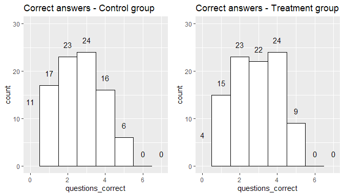

Speaking Science
================
Aris Fotkatžikis, Haerang Lee, Mumin Khan

  - [EDA](#eda)
  - [Simple Linear Regression](#simple-linear-regression)
  - [Randomization Inference](#randomization-inference)
  - [Stargazer](#stargazer)
  - [Subgroup testing](#subgroup-testing)

``` r
read_data <- function(data_file) {
  if(missing(data_file)) {
    data_file <- 'speaking_science_data_03-24_clean.csv'
  }
  
  d <- fread(data_file, )
  
  names = c('response_id', 'duration_in_seconds', 'time_read_article', 'credibility', 'importance', 'q1_correct', 'q2_correct', 'q3_correct', 'q4_correct', 'q5_correct', 'q6_correct', 'questions_correct', 'time_answering_questions', 'donation', 'treatment')

  d <- d[, names, with = FALSE]
  d <- na.omit(d)
  
  return(d)
}
```

# EDA

We have changed the text of questions to simplify things: -
Statement\_1: Please respond to the following statements. - I find this
article credible. - Statement\_2: Click to write the question text - How
important is it to address the pollution issue addressed in the article?
- Q\_1: What is the cost to the shipping industry over the next decade
to comply with the new rules? Correct answer is: Over $2 billion - Q\_2:
According to the article, what is *currently* the primary source of
smog-forming pollution in the state? Correct answer is: Heavy-duty
diesel trucks. - Q\_3: Which of the following is NOT one of the major
negative health outcomes of air pollution as mentioned in the article?
Correct answer is: Bronchitis - Q\_4: Which of the following reasons is
NOT a reason why establishing and enforcing a new shore power rules for
ships will be difficult? Correct answer is: Plugging a ship into shore
power requires many workers and several hours - Q\_5: Which statement
best describes the shipment industry’s attitude toward state regulators’
plan to reduce smoke-causing pollutants? Correct answer is: A new and
strict regulation may be too costly for the industry. - Q\_6: According
to the article, who currently bears the highest cost of pollution?
Correct answer is: Residents who live near the port, in terms of
negative health impacts.

``` r
d_1 <- read_data()
head(d_1)
```

    ##          response_id duration_in_seconds time_read_article credibility
    ## 1: R_3si5y4qwGLzKYPh                  85            17.922           5
    ## 2: R_1jqhwROmmrLPaoy                 185            29.649           5
    ## 3: R_2ASHk9ILabLrZCB                 284           166.381           6
    ## 4: R_3n6PLtv1K8spEfC                 379            67.943           7
    ## 5: R_3kbIZqjBaOkb1pG                 163            47.366           6
    ## 6: R_sRUrOCfBuUjTAuB                 275           163.601           7
    ##    importance q1_correct q2_correct q3_correct q4_correct q5_correct q6_correct
    ## 1:          4          0          1          0          0          0          0
    ## 2:          4          1          0          1          0          1          1
    ## 3:          7          0          1          0          0          1          1
    ## 4:          6          0          1          1          0          0          0
    ## 5:          6          0          0          0          0          0          1
    ## 6:          7          1          0          1          0          0          1
    ##    questions_correct time_answering_questions donation treatment
    ## 1:                 1                   22.689       50         1
    ## 2:                 4                  125.852        1         0
    ## 3:                 3                   67.334        1         0
    ## 4:                 2                  287.135        0         1
    ## 5:                 1                   49.709       50         1
    ## 6:                 3                   72.550        0         1

``` r
# Most dificult question
paste("Number of correct answers for question Q_1, is: ", sum(d_1$q1_correct))
```

    ## [1] "Number of correct answers for question Q_1, is:  102"

``` r
paste("Number of correct answers for question Q_2, is: ", sum(d_1$q2_correct))
```

    ## [1] "Number of correct answers for question Q_2, is:  58"

``` r
paste("Number of correct answers for question Q_3, is: ", sum(d_1$q3_correct))
```

    ## [1] "Number of correct answers for question Q_3, is:  76"

``` r
paste("Number of correct answers for question Q_4, is: ", sum(d_1$q4_correct))
```

    ## [1] "Number of correct answers for question Q_4, is:  34"

``` r
paste("Number of correct answers for question Q_5, is: ", sum(d_1$q5_correct))
```

    ## [1] "Number of correct answers for question Q_5, is:  109"

``` r
paste("Number of correct answers for question Q_6, is: ", sum(d_1$q6_correct))
```

    ## [1] "Number of correct answers for question Q_6, is:  118"

``` r
boxplot(time_read_article~questions_correct, 
        data=d_1, 
        main="Number of correct answers vs. duration",
        ylab="Survey duration ", xlab="Number of correct answers out of 6 Qs ", 
        pch=19)
```

<!-- -->

``` r
d_1$questions_correct <- as.factor(d_1$questions_correct)
ggplot(d_1, aes(x = questions_correct, y = time_read_article, color = treatment )) + geom_boxplot()
```

<!-- -->

``` r
boxplot(donation~questions_correct, data=d_1, main="Number of correct answers vs. donation amount",
   ylab="Donation amount in $ ", xlab="Number of correct answers out of 6 Qs ", pch=19)
```

<!-- -->

``` r
d_1$treatment <- as.factor(d_1$treatment)
d_1$questions_correct <-as.factor(d_1$questions_correct)
ggplot(d_1, aes(x = questions_correct, y = donation, color = treatment )) + geom_boxplot()
```

<!-- -->

``` r
ggplot(
  d_1, aes(x = time_read_article, fill = treatment)) + 
  geom_density(color = "darkblue", fill = "lightblue") + 
  ggtitle("Density of Time Reading Article") + geom_rug() + 
  xlab("Seconds") + 
  ylab("Density")
```

<!-- -->

``` r
ggplot(d_1[treatment ==0], aes(x = donation, fill = treatment)) + geom_density(color = "darkblue", fill = "lightblue") + geom_vline(aes(xintercept = mean(donation)), color = "darkgreen", linetype = "dashed", size = 1) + geom_vline(aes(xintercept = median(donation)), color = "black", linetype = "dashed", size = 1) + xlab("Donation ($)") + annotate("text", x = 42, y = 0.02, label = "Mean: $31.11", color = "darkgreen") + ggtitle("Density of donation amount for Control Group") + geom_rug() + ylab("Density")
```

<!-- -->

``` r
ggplot(d_1[treatment == 1], aes(x = donation, fill = treatment)) + geom_density(color = "darkgreen", fill = "lightgreen") + geom_vline(aes(xintercept = mean(donation)), color = "darkgreen", linetype = "dashed", size = 1) + geom_vline(aes(xintercept = median(donation)), color = "black", linetype = "dashed", size = 1) + xlab("Donation ($)") + annotate("text", x = 37, y = 0.02, label = "Mean: $27.15", color = "darkgreen") + annotate("text", x = 2, y = 0.02, label = "Median: $10", color = "black") + ggtitle("Density of donation amount for Treatment Group") + geom_rug() + ylab("Density")
```

<!-- -->

``` r
d_1
```

    ##            response_id duration_in_seconds time_read_article credibility
    ##   1: R_3si5y4qwGLzKYPh                  85            17.922           5
    ##   2: R_1jqhwROmmrLPaoy                 185            29.649           5
    ##   3: R_2ASHk9ILabLrZCB                 284           166.381           6
    ##   4: R_3n6PLtv1K8spEfC                 379            67.943           7
    ##   5: R_3kbIZqjBaOkb1pG                 163            47.366           6
    ##  ---                                                                    
    ## 190: R_28Y6wOs1nQypgbR                 698           472.460           5
    ## 191: R_1CybeFMYXPsaJuR                 663           131.387           5
    ## 192: R_2aIV06do8wlBzmD                 255            16.449           6
    ## 193: R_uz9T8WE0U2fcmAh                 596           391.195           7
    ## 194: R_3iFmJfhM37VBwG9                 641           420.562           7
    ##      importance q1_correct q2_correct q3_correct q4_correct q5_correct
    ##   1:          4          0          1          0          0          0
    ##   2:          4          1          0          1          0          1
    ##   3:          7          0          1          0          0          1
    ##   4:          6          0          1          1          0          0
    ##   5:          6          0          0          0          0          0
    ##  ---                                                                  
    ## 190:          7          1          0          0          0          1
    ## 191:          6          1          1          0          0          1
    ## 192:          6          1          1          1          0          0
    ## 193:          5          1          0          1          0          1
    ## 194:          7          1          0          0          0          1
    ##      q6_correct questions_correct time_answering_questions donation treatment
    ##   1:          0                 1                   22.689       50         1
    ##   2:          1                 4                  125.852        1         0
    ##   3:          1                 3                   67.334        1         0
    ##   4:          0                 2                  287.135        0         1
    ##   5:          1                 1                   49.709       50         1
    ##  ---                                                                         
    ## 190:          1                 3                  148.423        0         1
    ## 191:          0                 3                  444.574       15         0
    ## 192:          1                 4                  143.729       80         1
    ## 193:          1                 4                  134.436        0         0
    ## 194:          1                 3                  136.182        5         1

``` r
mean(d_1[d_1$treatment == 0, donation])
```

    ## [1] 31.1134

``` r
control_mean_donation <- mean(d_1[treatment == 0, donation])
treat_mean_donation <- mean(d_1[treatment == 1, donation])

ggplot(d_1, aes(x = donation, fill = treatment)) + 
  geom_density(alpha = 0.4) +
  geom_vline(aes(xintercept = control_mean_donation), color = "darkgreen", linetype = "dashed", size = 1) + 
  geom_vline(aes(xintercept = treat_mean_donation), color = "black", linetype = "dashed", size = 1) +
  annotate("text", x = 48, y = 0.02, label = paste("Control mean: $", round(control_mean_donation, 2)), color = "darkgreen") + 
  annotate("text", x = 11, y = 0.02, label = paste("Treatment mean: $", round(treat_mean_donation, 2)), color = "black") + 
  ggtitle("Density of donation amount for Control and Treatment") + geom_rug() + 
  ylab("Density") +
  xlab("Donation ($)")
```

<!-- -->

``` r
# Kolmogorvo-Smirnov test to check if the distributions of donations between control and treatment differ. Used the bootstrap version since 
# the distributions are not continuous
#ks.test(d_1$donation[d_1$treatment == 0],d_1$donation[d_1$treatment == 1])
ks.boot(d_1$donation[d_1$treatment == 0],d_1$donation[d_1$treatment == 1], nboots = 100)
```

    ## Warning in ks.boot(d_1$donation[d_1$treatment == 0], d_1$donation[d_1$treatment == : For publication quality p-values it is recommended that 'nboots'
    ##  be set equal to at least 500 (preferably 1000)

    ## $ks.boot.pvalue
    ## [1] 0.5
    ## 
    ## $ks
    ## 
    ##  Two-sample Kolmogorov-Smirnov test
    ## 
    ## data:  Tr and Co
    ## D = 0.10309, p-value = 0.6812
    ## alternative hypothesis: two-sided
    ## 
    ## 
    ## $nboots
    ## [1] 100
    ## 
    ## attr(,"class")
    ## [1] "ks.boot"

``` r
wilcox.test(d_1$donation[d_1$treatment == 0], d_1$donation[d_1$treatment == 1])
```

    ## 
    ##  Wilcoxon rank sum test with continuity correction
    ## 
    ## data:  d_1$donation[d_1$treatment == 0] and d_1$donation[d_1$treatment == 1]
    ## W = 5105.5, p-value = 0.2963
    ## alternative hypothesis: true location shift is not equal to 0

``` r
hist(d_1$donation)
```

<!-- -->

``` r
s1<-ggplot(d_1, aes(x=credibility)) + 
  geom_histogram(binwidth = 1, color="black", fill="white")+
  scale_x_continuous(breaks=seq(0, 7, 1))+
  ggtitle("I find the article Credible")
s1
```

<!-- -->

``` r
s2<-ggplot(d_1, aes(x=importance)) + 
  geom_histogram(binwidth = 1, color="black", fill="white")+
  scale_x_continuous(breaks=seq(0, 7, 1))+
  ggtitle("I find the issue discussed Important")
s2
```

<!-- -->
Let’s look at the breakdown of Credibility for the treatmnent and
control groups.

``` r
d_1$treatment <-as.factor(d_1$treatment)
d_1$importance <-as.factor(d_1$importance)
#ggplot(d_1, aes(x = importance, color = treatment )) + geom_boxplot()
```

``` r
d_1_control <- d_1[treatment==0]
d_1_treatment <-d_1[treatment==1]
```

``` r
plot1<- ggplot(d_1[d_1$treatment == 0], aes(x=credibility)) + 
  geom_histogram(binwidth = 1, color="black", fill="white")+
  stat_bin(binwidth=1, geom="text", aes(label=..count..), vjust=-1.5) +
  xlim(0, 7.5) +
  ylim(0, 55)+
  ggtitle("Credibility - Control group")

plot2<- ggplot(d_1[d_1$treatment == 1], aes(x=credibility)) + 
  geom_histogram(binwidth = 1, color="black", fill="white")+
   stat_bin(binwidth=1, geom="text", aes(label=..count..), vjust=-1.5) +
   xlim(0, 7.5) +
  ylim(0, 55)+
  ggtitle("Credibility - Treatment group")

grid.arrange(plot1, plot2, ncol=2)
```

    ## Warning: Removed 1 rows containing missing values (geom_bar).
    
    ## Warning: Removed 1 rows containing missing values (geom_bar).

<!-- -->

``` r
d_1 <- read_data()  # For some reasons I'm getting an error indicating an issue with the values supplied
scale_x_continuous()
```

    ## <ScaleContinuousPosition>
    ##  Range:  
    ##  Limits:    0 --    1

``` r
plot1<- ggplot(d_1[d_1$treatment == 0], aes(x=importance)) + 
  geom_histogram(binwidth = 1, color="black", fill="white")+
  stat_bin(binwidth=1, geom="text", aes(label=..count..), vjust=-1.5) +
  xlim(0, 7.5) +
  ylim(0, 55)+
  ggtitle("Importance - Control group")

plot2<- ggplot(d_1[d_1$treatment == 1], aes(x=importance)) + 
  geom_histogram(binwidth = 1, color="black", fill="white")+
   stat_bin(binwidth=1, geom="text", aes(label=..count..), vjust=-1.5) +
   xlim(0, 7.5) +
  ylim(0, 55)+
  ggtitle("Importance - Treatment group")

grid.arrange(plot1, plot2, ncol=2)
```

    ## Warning: Removed 1 rows containing missing values (geom_bar).
    
    ## Warning: Removed 1 rows containing missing values (geom_bar).

<!-- -->

``` r
ks.boot(d_1$importance[d_1$treatment == 0],d_1$importance[d_1$treatment == 1], nboots = 1000)
```

    ## $ks.boot.pvalue
    ## [1] 0.032
    ## 
    ## $ks
    ## 
    ##  Two-sample Kolmogorov-Smirnov test
    ## 
    ## data:  Tr and Co
    ## D = 0.16495, p-value = 0.1428
    ## alternative hypothesis: two-sided
    ## 
    ## 
    ## $nboots
    ## [1] 1000
    ## 
    ## attr(,"class")
    ## [1] "ks.boot"

``` r
ks.boot(d_1$credibility[d_1$treatment == 0],d_1$credibility[d_1$treatment == 1], nboots = 100)
```

    ## Warning in ks.boot(d_1$credibility[d_1$treatment == 0], d_1$credibility[d_1$treatment == : For publication quality p-values it is recommended that 'nboots'
    ##  be set equal to at least 500 (preferably 1000)

    ## $ks.boot.pvalue
    ## [1] 0.36
    ## 
    ## $ks
    ## 
    ##  Two-sample Kolmogorov-Smirnov test
    ## 
    ## data:  Tr and Co
    ## D = 0.092784, p-value = 0.7979
    ## alternative hypothesis: two-sided
    ## 
    ## 
    ## $nboots
    ## [1] 100
    ## 
    ## attr(,"class")
    ## [1] "ks.boot"

``` r
d_1 <- read_data()  # For some reasons I'm getting an error indicating an issue with the values supplied
scale_x_discrete()
```

    ## <ggproto object: Class ScaleDiscretePosition, ScaleDiscrete, Scale, gg>
    ##     aesthetics: x xmin xmax xend
    ##     axis_order: function
    ##     break_info: function
    ##     break_positions: function
    ##     breaks: waiver
    ##     call: call
    ##     clone: function
    ##     dimension: function
    ##     drop: TRUE
    ##     expand: waiver
    ##     get_breaks: function
    ##     get_breaks_minor: function
    ##     get_labels: function
    ##     get_limits: function
    ##     guide: none
    ##     is_discrete: function
    ##     is_empty: function
    ##     labels: waiver
    ##     limits: NULL
    ##     make_sec_title: function
    ##     make_title: function
    ##     map: function
    ##     map_df: function
    ##     n.breaks.cache: NULL
    ##     na.translate: TRUE
    ##     na.value: NA
    ##     name: waiver
    ##     palette: function
    ##     palette.cache: NULL
    ##     position: bottom
    ##     range: <ggproto object: Class RangeDiscrete, Range, gg>
    ##         range: NULL
    ##         reset: function
    ##         train: function
    ##         super:  <ggproto object: Class RangeDiscrete, Range, gg>
    ##     range_c: <ggproto object: Class RangeContinuous, Range, gg>
    ##         range: NULL
    ##         reset: function
    ##         train: function
    ##         super:  <ggproto object: Class RangeContinuous, Range, gg>
    ##     reset: function
    ##     scale_name: position_d
    ##     train: function
    ##     train_df: function
    ##     transform: function
    ##     transform_df: function
    ##     super:  <ggproto object: Class ScaleDiscretePosition, ScaleDiscrete, Scale, gg>

``` r
plot1<- ggplot(d_1[d_1$treatment == 0], aes(x=questions_correct)) + 
  geom_histogram(binwidth = 1, color="black", fill="white")+
  stat_bin(binwidth=1, geom="text", aes(label=..count..), vjust=-1.5) +
  xlim(0, 7) +
  ylim(0, 30)+
  ggtitle("Correct answers - Control group")


plot2<- ggplot(d_1[d_1$treatment == 1], aes(x=questions_correct)) + 
  geom_histogram(binwidth = 1, color="black", fill="white")+
  stat_bin(binwidth=1, geom="text", aes(label=..count..), vjust=-1.5) +
  xlim(0, 7) +
  ylim(0, 30)+
  ggtitle("Correct answers - Treatment group")

grid.arrange(plot1, plot2, ncol=2)
```

    ## Warning: Removed 2 rows containing missing values (geom_bar).
    
    ## Warning: Removed 2 rows containing missing values (geom_bar).

<!-- -->

``` r
ks.boot(d_1$questions_correct[d_1$treatment == 0],d_1$questions_correct[d_1$treatment == 1], nboots = 100)
```

    ## Warning in ks.boot(d_1$questions_correct[d_1$treatment == 0], d_1$questions_correct[d_1$treatment == : For publication quality p-values it is recommended that 'nboots'
    ##  be set equal to at least 500 (preferably 1000)

    ## $ks.boot.pvalue
    ## [1] 0.31
    ## 
    ## $ks
    ## 
    ##  Two-sample Kolmogorov-Smirnov test
    ## 
    ## data:  Tr and Co
    ## D = 0.1134, p-value = 0.5609
    ## alternative hypothesis: two-sided
    ## 
    ## 
    ## $nboots
    ## [1] 100
    ## 
    ## attr(,"class")
    ## [1] "ks.boot"

``` r
d_1$treatment <-as.factor(d_1$treatment)

ggplot(d_1, aes(x = time_read_article, fill = treatment)) + 
  geom_density(alpha = 0.4) +
  geom_vline(aes(xintercept = mean(d_1[d_1$treatment == 0, time_read_article])), color = "darkgreen", linetype = "dashed", size = 1) + 
  geom_vline(aes(xintercept = mean(d_1[d_1$treatment == 1, time_read_article])), color = "black", linetype = "dashed", size = 1) +
  annotate("text", x = 105, y = 0.0035, label = "Control mean: \n 185.0 s", color = "darkgreen") + 
  annotate("text", x = 345, y = 0.004, label = "Treatm.mean: 195.9", color = "black") + 
  ggtitle("Density of time spent reading the article for Control and Treatment") + geom_rug() + 
  ylab("Density") +
  xlab("Time reading article (s)")
```

<!-- -->

``` r
mean(d_1[d_1$treatment == 0, time_read_article])
```

    ## [1] 184.964

``` r
mean(d_1[d_1$treatment == 1, time_read_article])
```

    ## [1] 195.91

``` r
ks.boot(d_1$time_read_article[d_1$treatment == 0],d_1$time_read_article[d_1$treatment == 1], nboots = 100)
```

    ## Warning in ks.boot(d_1$time_read_article[d_1$treatment == 0], d_1$time_read_article[d_1$treatment == : For publication quality p-values it is recommended that 'nboots'
    ##  be set equal to at least 500 (preferably 1000)

    ## $ks.boot.pvalue
    ## [1] 0.28
    ## 
    ## $ks
    ## 
    ##  Two-sample Kolmogorov-Smirnov test
    ## 
    ## data:  Tr and Co
    ## D = 0.14433, p-value = 0.2645
    ## alternative hypothesis: two-sided
    ## 
    ## 
    ## $nboots
    ## [1] 100
    ## 
    ## attr(,"class")
    ## [1] "ks.boot"

``` r
# I think the ks.boot test is more appropriate but please confirm
t.test(d_1$time_read_article[d_1$treatment == 0], d_1$time_read_article[d_1$treatment == 1], alternative = c("two.sided"), mu = 0,  conf.level = 0.95)
```

    ## 
    ##  Welch Two Sample t-test
    ## 
    ## data:  d_1$time_read_article[d_1$treatment == 0] and d_1$time_read_article[d_1$treatment == 1]
    ## t = -0.48324, df = 190.48, p-value = 0.6295
    ## alternative hypothesis: true difference in means is not equal to 0
    ## 95 percent confidence interval:
    ##  -55.62483  33.73296
    ## sample estimates:
    ## mean of x mean of y 
    ##   184.964   195.910

``` r
plot1<- ggplot(d_1_control, aes(x=donation)) + 
  geom_histogram(bins=10, color="black", fill="white")+
  ylim(0, 100)+
  ggtitle("Donation amount - Control group")

plot2<- ggplot(d_1_treatment, aes(x=donation)) + 
  geom_histogram(bins=10, color="black", fill="white")+
  ylim(0,100)+
  ggtitle("Donation amount - Treatment group")

grid.arrange(plot1, plot2, ncol=2)
```

<!-- -->

``` r
min_breaks <- c(0, 60, 120, 180, 240, 300, 360, 420, 480, 540, 600, 800)

hist(d_1[, time_read_article], breaks = min_breaks, freq = TRUE, labels = TRUE, 
     ylim = c(0, 60),
     xlab = "Time (Seconds)",
     main = "Time Reading the Article")
```

    ## Warning in plot.histogram(r, freq = freq1, col = col, border = border, angle =
    ## angle, : the AREAS in the plot are wrong -- rather use 'freq = FALSE'

<!-- -->

``` r
minutes <- seq(1, 10) * 60

(count(d_1[time_read_article <= minutes[1]])/count(d_1))
```

    ##           n
    ## 1 0.2783505

``` r
(count(d_1[time_read_article <= minutes[2]])/count(d_1))
```

    ##           n
    ## 1 0.4123711

``` r
(count(d_1[time_read_article <= minutes[3]])/count(d_1))
```

    ##           n
    ## 1 0.5773196

``` r
(count(d_1[time_read_article <= minutes[4]])/count(d_1))
```

    ##           n
    ## 1 0.6443299

``` r
(count(d_1[time_read_article <= minutes[5]])/count(d_1))
```

    ##           n
    ## 1 0.7628866

# Simple Linear Regression

``` r
d <- read_data()
```

``` r
mod <- lm(questions_correct ~ treatment, data=d)
stargazer(mod, type = "text")
```

    ## 
    ## ===============================================
    ##                         Dependent variable:    
    ##                     ---------------------------
    ##                          questions_correct     
    ## -----------------------------------------------
    ## treatment                     0.402**          
    ##                               (0.198)          
    ##                                                
    ## Constant                     2.361***          
    ##                               (0.140)          
    ##                                                
    ## -----------------------------------------------
    ## Observations                    194            
    ## R2                             0.021           
    ## Adjusted R2                    0.016           
    ## Residual Std. Error      1.377 (df = 192)      
    ## F Statistic            4.136** (df = 1; 192)   
    ## ===============================================
    ## Note:               *p<0.1; **p<0.05; ***p<0.01

``` r
#Non parametric test
mod <- lm(credibility ~ treatment, data=d)
summary(mod)
```

    ## 
    ## Call:
    ## lm(formula = credibility ~ treatment, data = d)
    ## 
    ## Residuals:
    ##     Min      1Q  Median      3Q     Max 
    ## -3.6907 -0.6907  0.1753  0.3093  1.3093 
    ## 
    ## Coefficients:
    ##             Estimate Std. Error t value Pr(>|t|)    
    ## (Intercept)  5.69072    0.09232  61.639   <2e-16 ***
    ## treatment    0.13402    0.13056   1.026    0.306    
    ## ---
    ## Signif. codes:  0 '***' 0.001 '**' 0.01 '*' 0.05 '.' 0.1 ' ' 1
    ## 
    ## Residual standard error: 0.9093 on 192 degrees of freedom
    ## Multiple R-squared:  0.005458,   Adjusted R-squared:  0.0002779 
    ## F-statistic: 1.054 on 1 and 192 DF,  p-value: 0.306

``` r
mod <- lm(importance ~ treatment, data=d)
stargazer(mod, type = "text")
```

    ## 
    ## ===============================================
    ##                         Dependent variable:    
    ##                     ---------------------------
    ##                             importance         
    ## -----------------------------------------------
    ## treatment                     0.289*           
    ##                               (0.162)          
    ##                                                
    ## Constant                     5.918***          
    ##                               (0.114)          
    ##                                                
    ## -----------------------------------------------
    ## Observations                    194            
    ## R2                             0.016           
    ## Adjusted R2                    0.011           
    ## Residual Std. Error      1.126 (df = 192)      
    ## F Statistic            3.190* (df = 1; 192)    
    ## ===============================================
    ## Note:               *p<0.1; **p<0.05; ***p<0.01

``` r
mod <- lm(time_read_article ~ treatment, data=d)
summary(mod)
```

    ## 
    ## Call:
    ## lm(formula = time_read_article ~ treatment, data = d)
    ## 
    ## Residuals:
    ##     Min      1Q  Median      3Q     Max 
    ## -179.58 -137.36  -30.77  100.49  558.93 
    ## 
    ## Coefficients:
    ##             Estimate Std. Error t value Pr(>|t|)    
    ## (Intercept)   184.96      16.02  11.548   <2e-16 ***
    ## treatment      10.95      22.65   0.483    0.629    
    ## ---
    ## Signif. codes:  0 '***' 0.001 '**' 0.01 '*' 0.05 '.' 0.1 ' ' 1
    ## 
    ## Residual standard error: 157.7 on 192 degrees of freedom
    ## Multiple R-squared:  0.001215,   Adjusted R-squared:  -0.003987 
    ## F-statistic: 0.2335 on 1 and 192 DF,  p-value: 0.6295

``` r
wilcox.test(d[treatment == 0, donation], d[treatment == 1, donation])
```

    ## 
    ##  Wilcoxon rank sum test with continuity correction
    ## 
    ## data:  d[treatment == 0, donation] and d[treatment == 1, donation]
    ## W = 5105.5, p-value = 0.2963
    ## alternative hypothesis: true location shift is not equal to 0

``` r
wilcox.test(d[treatment == 0, importance], d[treatment == 1, importance])
```

    ## 
    ##  Wilcoxon rank sum test with continuity correction
    ## 
    ## data:  d[treatment == 0, importance] and d[treatment == 1, importance]
    ## W = 3969.5, p-value = 0.04491
    ## alternative hypothesis: true location shift is not equal to 0

``` r
wilcox.test(d[treatment == 0, credibility], d[treatment == 1, credibility])
```

    ## 
    ##  Wilcoxon rank sum test with continuity correction
    ## 
    ## data:  d[treatment == 0, credibility] and d[treatment == 1, credibility]
    ## W = 4371, p-value = 0.3607
    ## alternative hypothesis: true location shift is not equal to 0

# Randomization Inference

Testing the sharp null hypothesis that the treatment has no effect for
anyone.

``` r
# Actual ATE's
ate_questions_correct <- d[, .('group_mean' = mean(questions_correct)), by=treatment][order(treatment), diff(group_mean)] 
ate_credibility       <- d[, .('group_mean' = mean(credibility)),       by=treatment][order(treatment), diff(group_mean)] 
ate_importance        <- d[, .('group_mean' = mean(importance)),        by=treatment][order(treatment), diff(group_mean)] 
ate_time_read_article <- d[, .('group_mean' = mean(time_read_article)), by=treatment][order(treatment), diff(group_mean)] 
ate_donation          <- d[, .('group_mean' = mean(donation)),          by=treatment][order(treatment), diff(group_mean)] 
```

``` r
n <- 10000

# Initialize randomization inference 
ri_questions_correct <- rep(NA, n)
ri_credibility       <- rep(NA, n)
ri_importance        <- rep(NA, n)
ri_time_read_article <- rep(NA, n)
ri_donation          <- rep(NA, n)

for(i in 1:n){
  d_ri <- copy(d)
  d_ri$treatment <- sample(d_ri$treatment)
  
  # Is there any way to do this with a loop and col.names(ri)? I hate R...
  ri_questions_correct[i] <- d_ri[, .('group_mean' = mean(questions_correct)), by=treatment][order(treatment), diff(group_mean)] 
  ri_credibility[i]       <- d_ri[, .('group_mean' = mean(credibility)),       by=treatment][order(treatment), diff(group_mean)]
  ri_importance[i]        <- d_ri[, .('group_mean' = mean(importance)),        by=treatment][order(treatment), diff(group_mean)]   
  ri_time_read_article[i] <- d_ri[, .('group_mean' = mean(time_read_article)), by=treatment][order(treatment), diff(group_mean)]  
  ri_donation[i]          <- d_ri[, .('group_mean' = mean(donation)),          by=treatment][order(treatment), diff(group_mean)]  
  
}

ri <- data.table(
  questions_correct = ri_questions_correct,
  credibility       = ri_credibility,
  importance        = ri_importance,
  time_read_article = ri_time_read_article,
  donation          = ri_donation
)
```

``` r
visualize_ri <- function(d, ate, main, xlab, ylab) {
  if (missing(main)) { 
    main <- "Histogram of d"
  }
  if (missing(xlab)) { 
    xlab <- "d"
  }
  if (missing(ylab)) { 
    ylab <- "Frequency"
  }
  
  
  h <- hist(d, 
       xlim = c(min(d)-0.25, max(d)+0.25),
       main = main,
       xlab = xlab,
       ylab = ylab
       )
  abline(v=ate, col='red', lwd = 1)

  p <- mean(abs(ate) <= d)
  text(ate, max(h$counts) - (max(h$counts)/10), paste("p = ", p))
}

visualize_ri(ri$questions_correct, ate_questions_correct, main = paste("RI(",length(ri$questions_correct),") of Questions Correct"), xlab = "Treatment Effect")
```

<!-- -->

``` r
#visualize_ri(ri$credibility,       ate_credibility)
#visualize_ri(ri$importance,        ate_importance)
visualize_ri(ri$time_read_article, ate_time_read_article, main = paste("RI(",length(ri$time_read_article),") of Article Read Time (seconds)"), xlab = "Treatment Effect")
```

<!-- -->

``` r
visualize_ri(ri$donation,          ate_donation, main = paste("RI(",length(ri$donation),") of Donation (USD)"), xlab = "Treatment Effect")
```

<!-- -->

# Stargazer

    ## 
    ## Comparing Treatment Effects
    ## ============================================================================================
    ##                                                     Dependent variable:                     
    ##                                -------------------------------------------------------------
    ##                                Questions Correct Article Read Time (seconds) Donation in USD
    ##                                       (1)                    (2)                   (3)      
    ## --------------------------------------------------------------------------------------------
    ## Treatment                           0.402**                10.946                -3.959     
    ##                                    p = 0.044              p = 0.630             p = 0.393   
    ##                                                                                             
    ## --------------------------------------------------------------------------------------------
    ## Observations                          194                    194                   194      
    ## R2                                   0.021                  0.001                 0.004     
    ## Adjusted R2                          0.016                 -0.004                -0.001     
    ## Residual Std. Error (df = 192)       1.377                 157.746               32.167     
    ## F Statistic (df = 1; 192)           4.136**                 0.234                 0.735     
    ## ============================================================================================
    ## Note:                                                            *p<0.1; **p<0.05; ***p<0.01

# Subgroup testing

``` r
f <- read_data()
f$long_read <- f$time_read_article > 120

plot(density(f$time_read_article))
```

<!-- -->

``` r
wilcox.test(f[treatment == 0, importance],  f[treatment == 1, importance])
```

    ## 
    ##  Wilcoxon rank sum test with continuity correction
    ## 
    ## data:  f[treatment == 0, importance] and f[treatment == 1, importance]
    ## W = 3969.5, p-value = 0.04491
    ## alternative hypothesis: true location shift is not equal to 0

``` r
wilcox.test(f[treatment == 0, credibility], f[treatment == 1, credibility])
```

    ## 
    ##  Wilcoxon rank sum test with continuity correction
    ## 
    ## data:  f[treatment == 0, credibility] and f[treatment == 1, credibility]
    ## W = 4371, p-value = 0.3607
    ## alternative hypothesis: true location shift is not equal to 0

    ## 
    ## Comparing Treatment Effects
    ## ============================================================================================
    ##                                                     Dependent variable:                     
    ##                                -------------------------------------------------------------
    ##                                Questions Correct Article Read Time (seconds) Donation in USD
    ##                                       (1)                    (2)                   (3)      
    ## --------------------------------------------------------------------------------------------
    ## Treatment                           0.376**                 5.912                -3.448     
    ##                                    p = 0.035              p = 0.687             p = 0.422   
    ##                                                                                             
    ## long_read                          1.267***              244.170***            -24.757***   
    ##                                    p = 0.000              p = 0.000            p = 0.00000  
    ##                                                                                             
    ## --------------------------------------------------------------------------------------------
    ## Observations                          194                    194                   194      
    ## R2                                   0.224                  0.587                 0.148     
    ## Adjusted R2                          0.216                  0.583                 0.139     
    ## Residual Std. Error (df = 191)       1.229                 101.718               29.822     
    ## F Statistic (df = 2; 191)          27.578***             135.663***             16.619***   
    ## ============================================================================================
    ## Note:                                                            *p<0.1; **p<0.05; ***p<0.01

    ## 
    ## Comparing Treatment Effects
    ## =================================================================
    ##                                  Dependent variable:             
    ##                     ---------------------------------------------
    ##                                   Questions Correct              
    ##                              (1)                    (2)          
    ## -----------------------------------------------------------------
    ## Treatment                  0.402**                0.376**        
    ##                            (0.198)                (0.177)        
    ##                                                                  
    ## Read time > 120                                  1.267***        
    ##                                                   (0.179)        
    ##                                                                  
    ## -----------------------------------------------------------------
    ## Observations                 194                    194          
    ## R2                          0.021                  0.224         
    ## Adjusted R2                 0.016                  0.216         
    ## Residual Std. Error   1.377 (df = 192)       1.229 (df = 191)    
    ## F Statistic         4.136** (df = 1; 192) 27.578*** (df = 2; 191)
    ## =================================================================
    ## Note:                                 *p<0.1; **p<0.05; ***p<0.01

``` r
mod <- lm(questions_correct ~ treatment + time_read_article, data=f)
stargazer(mod, type = "text")
```

    ## 
    ## ===============================================
    ##                         Dependent variable:    
    ##                     ---------------------------
    ##                          questions_correct     
    ## -----------------------------------------------
    ## treatment                     0.360**          
    ##                               (0.178)          
    ##                                                
    ## time_read_article            0.004***          
    ##                               (0.001)          
    ##                                                
    ## Constant                     1.644***          
    ##                               (0.163)          
    ##                                                
    ## -----------------------------------------------
    ## Observations                    194            
    ## R2                             0.214           
    ## Adjusted R2                    0.206           
    ## Residual Std. Error      1.237 (df = 191)      
    ## F Statistic           26.048*** (df = 2; 191)  
    ## ===============================================
    ## Note:               *p<0.1; **p<0.05; ***p<0.01
