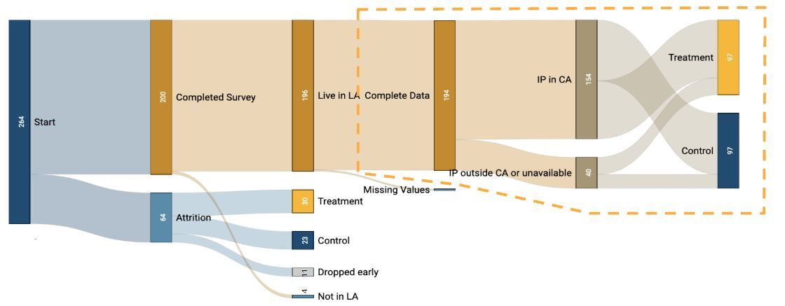

```{r, include=FALSE}
# load packages
library(data.table)
library(devtools)
library(dplyr)
library(foreign)
library(ggplot2)
library(gridExtra)
library(knitr)
library(lmtest)
library(Matching)
library(sandwich)
library(stargazer)

# Hide code chunks in PDF
knitr::opts_chunk$set(echo = FALSE, warning=FALSE, message=FALSE)
```

\pagebreak

# Executive Summary

In this experiment (N = **196** *[HL: check final N after]*), we examine whether the proximity to the location discussed in a science news article affects the reader's engagement with the article topic. We found that _____

# Introduction

Well-written science news spurs interest in the topic and inspires actions. One might expect a well-informed article on diabetes to compel readers to eat healthier. The news about the wonders of Mother Nature may inspire children to pay closer attention to the trees when they hike, to visit museums more, or perhaps even pursue a career in science. We started with the question of how effective science communication could increase the public's engagement with science.

While an examination of long-term engagements would have been ideal, we were strapped for resources. Then, we remembered a recent news article about how the rising sea levels may change the landscape of the Bay Area, where we live. It had compelled us to research the topic and become knowledgeable about how to change our behaviors to alleviate climate change. For this study, our research question focuses instead on the very first step of the long-term engagement: **Does the locality of a scientific article impact the reader's engagement with the issue discussed in the article?**

We recruited survey respondents from Los Angeles. We showed them an article that discussed air pollution caused by commercial ships visiting the regional ports. For those in the treatment group, the article referred to Los Angeles, and for those in the control group, the article referred to New York.

After they had read the articles, we asked them questions to collect the following outcomes.

1. Reading comprehension quiz score (0 - 6 points)
2. Donation amount toward alleviating air pollution, if they won a $100 raffle from this survey
3. Article reading time
4. Rating of importance of the air pollution issue
5. Rating of credibility of the article

We hypothesize that a locally-related topic would make people read the article more carefully and understand more of it. The implications of the results would mean that the science communities that hope to engage more people should target local communities.


# Experimental Design

## Narrowing Down the Question

The most challenging part of our journey was to crystallize the research question. We could have operationalized the concept of engagement in myriad ways: future college majors in a scientific discipline; museum visits; the likelihood of creating a vinegar volcano with kids at home; or eco-friendly product consumption.

In the first iteration of our research design, we considered testing whether the jargon and the author of a tweet would change the click-through rate (CTR). However, we did not believe that clicking on a link necessarily indicated an intrinsic fascination with science or signaled a long-term effect.

We reached out to a contact at the Lawrence Berkeley National Laboratory called Tim Hurt, who develops science education curriculums. He shared some surveys that his team used to measure students' interest or fascination with science. We considered using a modified version of this survey, which would have given us a self-reported level of engagement. However, we did not believe that a feeling of engagement with science would change within the short timeframe of our research. Finally, only after spending a long time exploring two utterly different research questions, we arrived at the idea of measuring the impact of local news on engagement.


## Choosing the Article

We gave careful considerations to the topic, which could influence the outcome. For instance, a divisive topic such as climate change could impact the engagement of a subset of the readers with a particular political affiliation and violate the excludability assumption. On the other extreme, a highly esoteric topic could fail to engage a majority of our readers. After some discussion, we determined that pollution and its impact on people's lives could be neutral and relatable enough for the study.

In our pilot study, we discovered more variables that affected the outcome. All of the respondents scored 100% on the reading comprehension quiz, because the article was too short and easy. The lack of variance implied that any existing treatment effect would be hard to detect. So we picked a new article that was longer and made the quiz harder.

Our article of choice was about large ships contributing to air pollution. We recruited participants from LA and used Qualtrics features to randomly assign treatment by the individual. The treatment group was given the article with references to LA. In contrast, the control group was given the same article with references to New York, because New York was a coastal city with a similar population as LA and had large ports that the article could be about.


## Treatment

The treatment is the locality of the article. We originally wanted to compare the effect of an article set in the reader's city, compared to a broader region like the country or even the world. The comparison between a city and a broader region may have been possible if we could have a bank of news articles, from which we could randomly select and give to each survey respondent. Such a design would require a large number of articles to control for other variables that may affect the outcome, including the source, topic, and diction.

Due to the limited resources we had, we wanted to stick to a single article in which the location keywords would be the only difference between treatment and control. Unfortunately, we could not exchange the name of a city for a state, country, or the world without completely changing the contents of the sentence and the article. So we changed the control variable to represent a remote city.  

\pagebreak

## Power Analysis & Outcome

```{r include=FALSE}
p <- fread('../data/pilot.csv')

p$d <-ifelse(is.na(p$"Q3.3_First Click"), 0, 1)
# p$Q5.5 <-ifelse(p$Q5.5=="Bronchitis", 1, 0)
p = subset(p, select = -c(2:14))
p = subset(p, select = -c(10:13, 15:29, 31:33))
names(p)[1] <- "reading.time"    # renamed from  "Duration (in seconds)"

```

### Reading Comprehension

We hypothesized that if a participant finds an article more interesting because it is related to their immediate residential environment, then they would read it more closely and retain more of the information. To measure the information retention, we designed a 6-question quiz and used quiz scores as an outcome variable representing engagement, fully recognizing the following limitations to this measurement. First, this methodology assumes that the quiz performance is an accurate representation of the comprehensionm, which is likely false. Second, the methodology treats the score as a continuous variable, although one's comprehension is not on a linear scale.

After conducting a pilot study, we studied the results and made a subjective determination that the true distribuution might look liike the following.

```{r fig.width = 4, fig.height= 2, echo=FALSE}
assumption.graph <- function(
  score.list,
  prob_control,   
  prob_treat,
  var_name,
  breaks
  ){
  # Simulate data 
together <- data.table(a = character(), var = numeric()) 

for (i in 1:length(score.list)){
  
  score <- score.list[i]
  howmany.c <- prob_control[i]
  howmany.t <- prob_treat[i]
  
  # Create a full data table that would have been summarized into d
  d_subset.t <- data.table(
          a =  c(rep("T", howmany.t)),
          var = c(rep(score, howmany.t))
          ) 
  
  d_subset.c <- data.table(
         a =  c(rep("C", howmany.c)),
         var = c(rep(score, howmany.c))) 
  
  # Add d_subset into together
  together <- rbind(together, d_subset.t, d_subset.c)
}
  
  # Plot histogram of data simulated with assumptions 
  p<- ggplot(data=together, aes(x = var, fill=a)
    ) +
    geom_histogram(position="dodge", breaks=breaks, aes(y=stat(width*density)))+
    theme(legend.position="right"#, axis.text.y=element_blank(), axis.ticks.y=element_blank()
          ) +
    labs(title = paste("Histograms of", var_name))+
    xlab(var_name) +
    ylab("Simulated frequency")+
    theme(axis.line = element_line(colour = "darkgray"),
    panel.grid.major = element_blank(),
    panel.grid.minor = element_blank(),
    panel.border = element_blank(),
    panel.background = element_blank())+ 
    geom_vline(aes(xintercept=mean(together[a=="C", var])), color="darkred", linetype="dashed", size=1)+ 
    geom_vline(aes(xintercept=mean(together[a=="T", var])), color="azure4", linetype="dashed", size=1)
  p
}

assumption.graph(
  score.list = c(0, 1, 2, 3, 4, 5, 6),
  prob_control= c(1, 4, 8, 10, 8, 4, 2),   
  prob_treat  = c(1, 2, 4, 8, 10, 8, 4),
  var_name = "Quiz Score",
  breaks=seq(0, 6, by=1)
  )
```

Assuming that the above represents the true distribution, the power analysis indicated that we would need at least 100 respondents to achieve a power of 90%. *(Note: Due to the random nature, the minimum sample size may change, but it's generally in the 100-120 range.)*

```{r}
# Function to run simulations and calculate power for each sim 
power_test_discrete <- function(
  conditions,
  prob_control,
  prob_treat,
  number_per_condition=50,    # 50 + 50 = 100
  power_loops = 100,
  ri_loops = 100,
  verbose = TRUE) {

    p_values <- NA
    ri <- NA
    d <- data.table()

    d[ , condition := rep(c('control', 'treatment'), each = number_per_condition)]

    for(power_loop in 1:power_loops) {
      if(verbose == TRUE) {
        if(power_loop %% 10 == 0) {
          # cat(sprintf('Loop Number: %.0f\n', power_loop))
        }
      }

      p_values[power_loop] <- t.test(
        x = sample(x = conditions, number_per_condition, replace = T, prob = prob_control),
        y = sample(x = conditions, number_per_condition, replace = T, prob = prob_treat)
      )$p.value
      }

    return(list(
      'p_values' = p_values,
      'power' = mean(p_values < 0.05)
      ))
}
```


```{r fig.width = 4, fig.height= 3, echo=FALSE}
# Function to plot power graph
plot.power <- function(
  conditions,
  prob_control,   
  prob_treat,
  samples_per_condition,
  power_loops,
  ri_loops,
  verbose,
  var_name
  ){
    
  size_power <- NA
  size.at.08 = 0
  size.at.09 = 0
  
  for(i in 1:length(samples_per_condition)) {
    pwr.for.sample.size <- power_test_discrete(
        conditions,
        prob_control,   
        prob_treat,
        number_per_condition = samples_per_condition[i],
        power_loops,
        ri_loops,
        verbose
        )$power
    
    size_power[i] <- pwr.for.sample.size
    if (size.at.08 == 0 && pwr.for.sample.size >= 0.8){
      size.at.08 <- samples_per_condition[i]
    } else if (size.at.09 == 0 && pwr.for.sample.size >= 0.9){
      size.at.09 <- samples_per_condition[i]
    }
  }
  
  annotation <- data.frame(
   x = c(size.at.08, size.at.09),
   y = c(0.8 - 0.03, 0.9 - 0.03),
   label = c(paste("80% at", size.at.08), 
             paste("90% at", size.at.09))
   )
  
  df <- data.frame(samples_per_condition, size_power)
    
  # Plot 
  pwr.plot <- ggplot(data=df, aes(x = samples_per_condition, y = size_power))+
              geom_line() + 
    # title and axis labels 
    labs(title=paste("Statistical Power for", var_name), x="Sample size", y = "Power")+
    ylim(0,1)

  # Mark 80% and 90% power lines 
  pwr.plot + 
    geom_hline(yintercept=0.8, col="blue", lty=2) +
    geom_vline(xintercept=size.at.08, col="blue", lty=2) +
  
    geom_hline(yintercept=0.9, col="red", lty=3) +
    geom_vline(xintercept=size.at.09, col="red", lty=3) +
  
  # remove background and grids
  theme(axis.line = element_line(colour = "darkgray"),
    panel.grid.major = element_blank(),
    panel.grid.minor = element_blank(),
    panel.border = element_blank(),
    panel.background = element_blank())+
  
  # Labels for 80-90% power 
  geom_label(data=annotation, aes( x=x, y=y, label=label),
              color="black", size=3 , angle=0, fontface="bold" , hjust = 0)
    
}

samples_per_condition <- c(10, 20, 30, 40, 50, 60, 70, 80, 90, 100, 120, 150, 170, 180, 200)

plot.power(
      conditions = c(0, 1, 2, 3, 4, 5, 6),
      prob_control= c(1, 4, 8, 10, 8, 4, 2),   
      prob_treat  = c(1, 2, 4, 8, 10, 8, 4),
      samples_per_condition=samples_per_condition,
      power_loops = 100,
      ri_loops = 100,
      verbose = TRUE,
      var_name = "Quiz Score"
      )

```

### Donation as an Action

We were interested in whether the treatment could compel the subjects to take action in real life. We measured the behavior by asking people to donate real currency toward the cause discussed in the article. We entered every survey participant in a raffle to win $100 and asked how much of the raffle winnings the respondent would like to donate toward alleviating air pollution. We stated that we would donate this amount on their behalf and award them the rest, should they win the raffle. This question forced people to put the money where their mouth was, rather than merely proclaiming that they cared. We hypothesized that the treatment group would be more engaged with the topic in the article and donate more toward the cause.

We were not sure what the actual distribution of donation amounts might look like. We tried two different assumptions and the power analysis indicated that either 100 observations would be enough or 700 would be insufficient to achieve the power of 90%. However, our budget did not allow us to collect more than 200 samples. In conclusion, we are uncertain that we will have enough power to detect any real treatment effects in the donation amounts in this study.

```{r fig.width = 8, fig.height= 5, echo=FALSE}
don.dist.1 <- assumption.graph(
  score.list = c(0, 10, 20, 30, 40, 50, 60, 70, 80, 90, 100),
  prob_control=  c(5, 2, 3, 2, 1, 1, 1, 1, 1, 1, 1), 
  prob_treat  =  c(3, 1, 1, 1, 1, 1, 1, 2, 3, 2, 1),
  var_name = "Donation Amount",
  breaks=seq(0, 100, by =10)
  )


don.dist.2 <- assumption.graph(
  score.list = c(0, 10, 20, 30, 40, 50, 60, 70, 80, 90, 100),
  prob_control=  c(6, 1, 2, 3, 1, 2, 1, 1, 1, 1, 1), 
  prob_treat  =  c(4, 1, 3, 1, 1, 3, 2, 1, 1, 1, 1),
  var_name = "Donation Amount",
  breaks=seq(0, 100, by =10)
  )

samples_per_condition <- c(10, 20, 30, 40, 50, 60, 70, 80, 90, 100, 120, 150, 170, 180, 200, 300, 400, 500, 600, 700, 800, 900, 1000)

don.power.1 <- plot.power(
      conditions = c(0, 10, 20, 30, 40, 50, 60, 70, 80, 90, 100),
      prob_control=  c(5, 2, 3, 2, 1, 1, 1, 1, 1, 1, 1), 
      prob_treat  =  c(3, 1, 1, 1, 1, 1, 1, 2, 3, 2, 1),
      samples_per_condition=samples_per_condition,
      power_loops = 100,
      ri_loops = 100,
      verbose = TRUE,
      var_name = "Donation Amount"
      )

don.power.2 <- plot.power(
      conditions = c(0, 10, 20, 30, 40, 50, 60, 70, 80, 90, 100),
      prob_control=  c(6, 1, 2, 3, 1, 2, 1, 1, 1, 1, 1), 
      prob_treat  =  c(4, 1, 3, 1, 1, 3, 2, 1, 1, 1, 1),
      samples_per_condition=samples_per_condition,
      power_loops = 100,
      ri_loops = 100,
      verbose = TRUE,
      var_name = "Donation Amount"
      )
grid.arrange(don.dist.1, don.power.1,
             don.dist.2, don.power.2, ncol = 2)
```


### Article Reading Time

```{r include=FALSE}
avgtime <- p[ , .('mu_reading.time' = mean(reading.time)), keyby = .(d)]
timeate <- avgtime[ , diff(mu_reading.time)]
time_d_1 = sd(p[d==1, reading.time])
time_d_0 = sd(p[d==0, reading.time])

p[ , t.test(reading.time ~ d)]   # not much difference here lolll 
```

For a long article of 1,300 words, compliance was a concern. However, in real life, we wouldn't expect most people to read the whole article. Since the location was indicated in the title of the article, we decided to think of that as the treatment and see how the reading time changes in response.

For the power analysis, we took the average reading time from the pilot, but reduced the standard deviation from the pilot by 20%, taking into account a larger sample size we will collect from the full study. As a result, we calculated that 100 observations is sufficient to achieve a power of 90%.

```{r}
assumption.graph.normal <- function(
  mean_control = 505
  ,mean_treat = 573
  ,sd_control = 120
  ,sd_treat =   120
  ,number_per_condition = 500
  ,var_name = "Reading Time (s)"
  ,maintitle= "Simulated Distributions of Treatment and Control"
  ){
  # Simulate data
  c = data.frame(a="C", var = rnorm(number_per_condition, mean = mean_control, sd = sd_control))
  t = data.frame(a="T", var = rnorm(number_per_condition, mean = mean_treat, sd = sd_treat))
  together <- data.frame(rbind(c, t))

  # Plot histogram of data simulated with assumptions
  p<- ggplot(data=together, aes(x = var, fill=a)
    ) +
    geom_histogram(position="dodge", binwidth=30, aes(y=stat(width*density)))+
    theme(legend.position="right") +
    #ggtitle(maintitle) +
    labs(title = paste("Histograms of ", var_name))+
    xlab(var_name) +
    ylab("Simulated frequency")+
    theme(axis.line = element_line(colour = "darkgray"),
    panel.grid.major = element_blank(),
    panel.grid.minor = element_blank(),
    panel.border = element_blank(),
    panel.background = element_blank())+
    geom_vline(aes(xintercept=mean_control), color="darkred", linetype="dashed", size=1)+
    geom_vline(aes(xintercept=mean_treat), color="azure4", linetype="dashed", size=1)
  p
}

read.assumed <- assumption.graph.normal()
```

```{r}
power_test_norm <- function(
  mean_control = 505,   # means are from pilot
  mean_treat = 573,
  sd_control = 120,     # I made up SD. SD from pilot is 150 so with more data I assume it is lower
  sd_treat =   120,
  number_per_condition = 50,   # 50*2 = 100 total respondents
  power_loops = 100,
  ri_loops = 100,
  verbose = TRUE) {

    p_values <- NA
    ri <- NA
    d <- data.table()

    d[ , condition := rep(c('control', 'treatment'), each = number_per_condition)]

    for(power_loop in 1:power_loops) {
      if(verbose == TRUE) {
        if(power_loop %% 10 == 0) {
          # cat(sprintf('Loop Number: %.0f\n', power_loop))
        }
      }

      p_values[power_loop] <- t.test(
        x = rnorm(number_per_condition, mean = mean_control, sd = sd_control),
        y = rnorm(number_per_condition, mean = mean_treat, sd = sd_treat)
      )$p.value

    }

    return(list(
      'p_values' = p_values,
      'power' = mean(p_values < 0.05)
      ))
}


```

```{r}
# Function to plot power graph
plot.power.norm <- function(
  samples_per_condition,
  power_loops,
  ri_loops,
  verbose,
  var_name
  ){
  size_power <- NA
  size.at.08 = 0
  size.at.09 = 0
  
  for(i in 1:length(samples_per_condition)) {
        pwr.for.sample.size <- power_test_norm(
          mean_control = 505,   # means are from pilot
          mean_treat = 573,
          sd_control = 120,
          sd_treat =   120,
          number_per_condition = samples_per_condition[i],
          power_loops = 100,
          ri_loops = 100,
          verbose = TRUE)$power
    
    size_power[i] <- pwr.for.sample.size
    if (size.at.08 == 0 && pwr.for.sample.size >= 0.8){
      size.at.08 <- samples_per_condition[i]
    } else if (size.at.09 == 0 && pwr.for.sample.size >= 0.9){
      size.at.09 <- samples_per_condition[i]
    }
  }
  
  annotation <- data.frame(
   x = c(size.at.08, size.at.09),
   y = c(0.8 - 0.03, 0.9 - 0.03),
   label = c(paste("80% at", size.at.08), 
             paste("90% at", size.at.09))
   )
  
  df <- data.frame(samples_per_condition, size_power)
    
  # Plot 
  pwr.plot <- ggplot(data=df, aes(x = samples_per_condition, y = size_power))+
              geom_line() + 
    # title and axis labels 
    labs(title=paste("Statistical Power for", var_name), x="Sample size", y = "Power")+
    ylim(0,1)

  # Mark 80% and 90% power lines 
  pwr.plot + 
    geom_hline(yintercept=0.8, col="blue", lty=2) +
    geom_vline(xintercept=size.at.08, col="blue", lty=2) +
  
    geom_hline(yintercept=0.9, col="red", lty=3) +
    geom_vline(xintercept=size.at.09, col="red", lty=3) +
  
  # remove background and grids
  theme(axis.line = element_line(colour = "darkgray"),
    panel.grid.major = element_blank(),
    panel.grid.minor = element_blank(),
    panel.border = element_blank(),
    panel.background = element_blank())+
  
  # Labels for 80-90% power 
  geom_label(data=annotation, aes( x=x, y=y, label=label),
              color="black", size=3 , angle=0, fontface="bold" , hjust = 0)
    
}

samples_per_condition <- c(10, 20, 30, 40, 50, 60, 70, 80, 90, 100, 120, 150, 170, 180, 200)

read.time.power <- plot.power.norm(
      samples_per_condition=samples_per_condition,
      power_loops = 100,
      ri_loops = 100,
      verbose = TRUE,
      var_name = "Reading Time"
      )

```

```{r fig.width = 8, fig.height= 2, echo=FALSE}
grid.arrange(read.assumed, read.time.power, ncol = 2)
```

\pagebreak

# Final Research Methodology

## Participant Recruitment and Randomization

Mechanical Turk only allowed us to filter the workers by the state. We recruited 200 survey respondents from Amazon Mechanical Turk in California. In order to filter workers by those living in LA, we instructed the workers to accept the task only if they lived in LA. Additionally, the first question on Qualtrics asked whether the respondent lived in LA and if they didn't, they exited the survey. As a result, all self-identifying LA residents were randomly assigned treatment or control, then given a series of questions.

## Outcome Measurement

In conclusion, we measured the following five outcomes.
1. Quiz score  
2. Donation amount  
3. Reading time  
4. Importance rating of issue  
5. Credibility rating of article  

In order to ensure a high quality response, we have communicated to the survey takers that they please read as they normally would read any other article and they do not cheat on the questions.


# Analysis and Results


```{r, include=FALSE}
# Import data

read_data <- function(data_file) {
  if(missing(data_file)) {
    data_file <- '../data/speaking_science_data_03-24_clean.csv'
  }

  d <- fread(data_file, )

  names = c('response_id', 'duration_in_seconds', 'time_read_article', 'credibility', 'importance', 'q1_correct', 'q2_correct', 'q3_correct', 'q4_correct', 'q5_correct', 'q6_correct', 'questions_correct', 'time_answering_questions', 'donation', 'treatment')

  d <- d[, names, with = FALSE]
  # d <- na.omit(d)

  return(d)
}
```


## Exploratory Data Analysis

A total of 264 people clicked on our survey on Mechanical Turk. 64 people did not complete the survey. Out of the 200 who completed the survey, we dropped 6 people, either due to missing quiz answers or because they stated that they were not LA residents. We did not exclude the 40 people whose IP address was from outside of CA, because they may be traveling. In the end, we had 97 people in treatment and 97 in control. See graphical representation of survey participants below. 


```{r pressure, echo=FALSE, fig.cap="Sankey Diagram of survey data", out.width = '100%'}


```

```{r include=FALSE}
d <- read_data()
summary(d)
nrow(d)
names(d)
```

Some questions were more difficult than others.

```{r, fig.width = 4, fig.height= 2}
scores <- d[, grep('correct', names(d)), with=FALSE][, 1:6]

sum.scores <- data.frame(score=apply(scores, 2, sum))
sum.scores$q = c("Q1", "Q2", "Q3", "Q4", "Q5", "Q6")

ggplot(data = sum.scores, aes(x=q, y=score, fill=q))+ geom_bar(stat="identity")+
  ggtitle("Histogram of Correct Submissions per Question") + 
  ylab("Num. Ppl who Got This Question Right") +
  xlab("Question Number")+
  theme(
    panel.grid.major = element_blank(),
    panel.grid.minor = element_blank(),
    panel.border = element_blank(),
    panel.background = element_blank())

```

```{r,  fig.width = 4, fig.height= 2, echo=FALSE}
# Average number of correct answers per group
mean.score.c <- round(d[d$treatment == 0][ , mean(questions_correct)], 2)
mean.score.t <-round(d[d$treatment == 1][ , mean(questions_correct)], 2)
```

Below is the histogram of the quiz scores, which resembles our assumed distribution at the power analysis steps, except that not a single respondent out of the final 196 observations scored 6 out of 6. The mean score of the treatment group was `r mean.score.t` and that of the control group was `r mean.score.c`.

```{r,  fig.width = 4, fig.height= 2, echo=FALSE}

ggplot(d, aes(x = questions_correct, fill = factor(treatment))) +
  # geom_density(alpha = 0.4) +
  geom_histogram(position="dodge", breaks=c(-0.5, 0.5, 1.5, 2.5, 3.5, 4.5, 5.5, 6.5, 7.5))+
  geom_vline(aes(xintercept = mean(d[d$treatment == 0, questions_correct])), color = "darkgreen", linetype = "dashed", size = 1) +
  geom_vline(aes(xintercept = mean(d[d$treatment == 1, questions_correct])), color = "black", linetype = "dashed", size = 1) +
  annotate("text", x = 2.3, y = 30, label = paste("Control mean:", mean.score.c), color = "darkgreen", hjust="right") +
  annotate("text", x = 2.8, y = 30, label = paste("Treat mean:", mean.score.t), color = "black", hjust="left") +
  ggtitle("Histogram of Quiz Scores") + geom_rug() +
  ylab("Frequency") +
  xlab("Quiz Scores")+
  theme(
    panel.grid.major = element_blank(),
    panel.grid.minor = element_blank(),
    panel.border = element_blank(),
    panel.background = element_blank())
```

The distribution of the reading time revealed that our assumption of normal distribution was incorrect. Although the article is 1,300 words and would take a very fast reader (200 words per minute) 7 minutes to read, about 30% of our respopndents are spending less than a minute and 40% under 2 minutes. The difference between treatment and control is only 10 seconds, as opposed to 70 seconds we thought we would see. 

```{r fig.width = 4, fig.height= 2, echo=FALSE}
ggplot(d, aes(x = time_read_article, fill = factor(treatment))) +
  # geom_density(alpha = 0.4) +
  geom_histogram(position="dodge", binwidth=30)+
  geom_vline(aes(xintercept = mean(d[d$treatment == 0, time_read_article])), color = "darkgreen", linetype = "dashed", size = 1) +
  geom_vline(aes(xintercept = mean(d[d$treatment == 1, time_read_article])), color = "black", linetype = "dashed", size = 1) +
  annotate("text", x = 180, y = 20, label = "Control mean: \n 185.0 s", color = "darkgreen", hjust="right") +
  annotate("text", x = 200, y = 20, label = "Treat mean:\n 195.9", color = "black", hjust="left") +
  ggtitle("Histogram of Reading Time") + geom_rug() +
  ylab("Frequency") +
  xlab("Reading Time (s)")+
  theme(
    panel.grid.major = element_blank(),
    panel.grid.minor = element_blank(),
    panel.border = element_blank(),
    panel.background = element_blank())
```


The actual distribution of donation amounts seems to have a much smaller treatment effect than either one of our assumed distributions at the time of the power analysis. Since our "worse case model" required more than 800 observations and this distribution seems to indicate even smaller (if any) treatment effect, we are doubtful we will detect any treatment effects here.


```{r fig.width = 4, fig.height= 2, echo=FALSE}
mean.don.c <- round(d[d$treatment == 0][ , mean(donation)], 2)
mean.don.t <-round(d[d$treatment == 1][ , mean(donation)], 2)


ggplot(d, aes(x = donation, fill = factor(treatment))) +
  # geom_density(alpha = 0.4) +
  geom_histogram(position="dodge", binwidth=10)+
  geom_vline(aes(xintercept = mean(d[d$treatment == 0, donation])), color = "darkgreen", linetype = "dashed", size = 1) +
  geom_vline(aes(xintercept = mean(d[d$treatment == 1, donation])), color = "black", linetype = "dashed", size = 1) +
  annotate("text", x = mean.don.c, y = 20, label = paste("Control mean", mean.don.c), color = "darkgreen", hjust="left") +
  annotate("text", x = mean.don.t, y = 20, label = paste("Treat mean", mean.don.t), color = "black", hjust="right") +
  ggtitle("Histogram of Donation Amount") + geom_rug() +
  ylab("Frequency") +
  xlab("Donation ($)")+
  theme(
    panel.grid.major = element_blank(),
    panel.grid.minor = element_blank(),
    panel.border = element_blank(),
    panel.background = element_blank())
```


We examined the distribution of reading time (left) and donation amount (right) per quiz score. Unsurprisingly, those who spend more time to read the article perform better on the quiz. On the other hand, those that performed better on the quiz, and therefore those we predicted to take more action in real life, tended to donate less toward the cause. It might indicate that the more effort people put in reading and answering the questions, the less they were inclined to donate their hard-earned money.


```{r, fig.width = 10, fig.height= 3, echo=FALSE}
a <- ggplot(d, aes(x = as.factor(questions_correct), y = time_read_article, color = factor(treatment) )) + geom_boxplot() + ylab("Reading Time (s)") +
  xlab("Quiz Score")+
  theme(
    panel.grid.major = element_blank(),
    panel.grid.minor = element_blank(),
    panel.border = element_blank(),
    panel.background = element_blank())

b <- ggplot(d, aes(x = factor(questions_correct), y = donation, color = factor(treatment) )) + geom_boxplot() + ylab("Donation ($)") +
  xlab("Quiz Score")+
  theme(
    panel.grid.major = element_blank(),
    panel.grid.minor = element_blank(),
    panel.border = element_blank(),
    panel.background = element_blank())

grid.arrange(a, b, ncol = 2)

```

We asked the participants to rate the topic importance and article credibility on a scale of 1 to 7. On the right, credibility seems similar between treatment and control. On the left, treatment tends to assign higher importance ratings than control. According to the Wilcoxon rank-sum test, this difference in importance rating is statistically significant at the 0.05 level, in accordance with our hypothesis.

```{r,fig.width = 10, fig.height= 3, echo=FALSE}
plot1 <- ggplot(d, aes(x = importance, fill = factor(treatment))) +
  # geom_density(alpha = 0.4) +
  geom_histogram(position="dodge",breaks=c(-0.5, 0.5, 1.5, 2.5, 3.5, 4.5, 5.5, 6.5, 7.5))+
  ggtitle("Histogram of Perceived Importance Ratings") + geom_rug() +
  ylab("Frequency") +
  xlab("Importance Rating")+
  theme(
    panel.grid.major = element_blank(),
    panel.grid.minor = element_blank(),
    panel.border = element_blank(),
    panel.background = element_blank())

plot2 <- ggplot(d, aes(x = credibility, fill = factor(treatment))) +
  # geom_density(alpha = 0.4) +
  geom_histogram(position="dodge",breaks=c(-0.5, 0.5, 1.5, 2.5, 3.5, 4.5, 5.5, 6.5, 7.5))+
  ggtitle("Histogram of Perceived Credibility Ratings") + geom_rug() +
  ylab("Frequency") +
  xlab("Credibility Rating")+
  theme(
    panel.grid.major = element_blank(),
    panel.grid.minor = element_blank(),
    panel.border = element_blank(),
    panel.background = element_blank())

grid.arrange(plot1, plot2, ncol = 2)
```

```{r}
# Test how different the distributions for treatment and control are for the Importance and Credibility ratings

wilcox.test(d$importance[d$treatment == 0], d$importance[d$treatment == 1])
wilcox.test(d$credibility[d$treatment == 0], d$credibility[d$treatment == 1])
```


# Results

## Compliance & Attrition

A surprising finding of our survey was how little time was spent reading the article. We had initially anticipated a normal or normal-esque shaped distribution of reading times around the 2 minute mark. Instead, we observed a highly right-skewed distribution (shown below) of article read times. This is likely an artifact of conducting our survey on Mechanical Turk; we discuss this in more detail later on. 

```{r, echo=FALSE}
d$treatment_factor <-as.factor(d$treatment)

mean_control_time <- round(mean(d[d$treatment_factor == 0, time_read_article]), 2)
mean_treatment_time <- round(mean(d[d$treatment_factor == 1, time_read_article]), 2)


ggplot(d, aes(x = time_read_article, fill = treatment_factor)) + 
  # geom_density(alpha = 0.4) +
  geom_histogram(position="dodge", binwidth=30)+
  geom_vline(aes(xintercept = mean_control_time), color = "darkgreen", linetype = "dashed", size = 1) + 
  geom_vline(aes(xintercept = mean_treatment_time), color = "black", linetype = "dashed", size = 1) +
  annotate("text", x = mean_control_time - 20, y = 12, label = paste("Control mean: \n ", mean_control_time), color = "darkgreen", hjust="right") + 
  annotate("text", x = mean_treatment_time + 20, y = 12, label = paste("Treatment mean: \n ", mean_treatment_time), color = "black", hjust="left") + 
  ggtitle("Histogram of Reading Time (Seconds)") + geom_rug() + 
  ylab("Frequency") +
  xlab("Reading Time (s)")+
  theme(
    panel.grid.major = element_blank(),
    panel.grid.minor = element_blank(),
    panel.border = element_blank(),
    panel.background = element_blank())
```

For our final analysis, we've opted to keep all reading times and not include observations for those who took fewer than 100 seconds to complete the questions portions of the survey. This is based on a question section length of 340 words and a read and answer composite time of 200 words per minute. The result is a dataset of 111 observations, 61 in control and 50 in treatment. We decided not to filter any of the Article Read Time values because our survey had forced people to stay on the page for 15 seconds. Furthermore, we believe that applying a words read per minute threshold might not be an accurate model of how people interact with journalistic writings, especially those that are scientifically oriented. We had a large number of attritors after the Mechanical Turk task was filled. We believe that this attrited was comprised of another random sampling of the population we sampled while the task was active, thus we have excluded those incomplete responses from this analysis with the belief that the exclusion won't bias our results in any direction.  

```{r, include=FALSE}
# d <- read_data()
d <- d[time_answering_questions > 100, ]
(table(d$treatment))
```


## Regression Results
A simple regression of our three outcome variables yields the following table.

```{r, echo=FALSE, results="asis"}
mod_1 <- lm(questions_correct ~ treatment, data=d)
mod_2 <- lm(time_read_article ~ treatment, data=d)
mod_3 <- lm(donation ~ treatment, data=d)

stargazer(mod_1,mod_2,mod_3,
          #type="text", # comment out when knitting
          header = FALSE,
          report = ("vc*p"),
          title = "Comparing Treatment Effects",
          covariate.labels = c("Treatment"),
          omit = c("Constant", "Observations"),
          dep.var.labels = c("Questions Correct", "Article Read Time (seconds)", "Donation in USD")
          )
```

As shown, we observed a treatment effect of `r round(mod_1$coefficients[[2]], 4)` with a p-value of `r round(anova(mod_1)$'Pr(>F)'[1], 4)` for the number of questions the survey taker answered correctly when treated. This hints that respondents who received the local (Los Angeles) article paid more attention to its contents and were able to recall information better on the quiz. Unfortunately, the same cannot be said about our Article Read Time outcome variable (ATE = `r round(mod_2$coefficients[[2]], 4)`, p=`r round(anova(mod_2)$'Pr(>F)'[1], 4)`) or our Donation ammount outcome variable (ATE = `r round(mod_3$coefficients[[2]], 4)`, p=`r round(anova(mod_3)$'Pr(>F)'[1], 4)`).

When considering the effect of treatment on the number of questions a respondent answered correctly, we wanted to make sure there were no unobserved confounds contributing to the effect. After running serveral analysis, the only significant covariate we found was Article read time. Taking Article Read Time into account yields the regression below.

```{r, echo=FALSE, results="asis"}
mod_1 <- lm(questions_correct ~ treatment + time_read_article, data=d)

stargazer(mod_1,
          #type="text", # comment out when knitting
          header = FALSE,
          report = ("vc*p"),
          title = "Comparing Treatment Effects",
          covariate.labels = c("Treatment", "Article Read Time (seconds)"),
          omit = c("Constant", "Observations"),
          dep.var.labels = c("Questions Correct")
)
```

The table does show a small effect of Article Read Time on the Questions Correct outcome variable, but the treatment effect is still there at `r round(mod_1$coefficients[[2]], 4)` and is still statistically significant at the 95% conficence level (p = `r round(anova(mod_1)$'Pr(>F)'[1], 4)`).

We were not able to measure a statistically signigcant effect from either Article Time Read or Donation Ammount outcome variables. To see if we were asking the right questions, we created a binned catagory of Article Read Times for each minute and a dummy variable to represent whether or not the respondent donated. As you can see from the table below, the results are inconclusive. Log transformations of both did not help.

```{r, echo=FALSE, results="asis"}
d$donator <- ifelse(d$donation > 0, 1, 0)
d$time_read_article_bins <- d$time_read_article %/% 60

mod_1 <- lm(time_read_article_bins ~ treatment, data=d)
mod_2 <- lm(donator ~ treatment, data=d)

stargazer(mod_1, mod_2,
          #type="text", # comment out when knitting
          header = FALSE,
          #report = ("vc*p"),
          title = "Comparing Treatment Effects",
          covariate.labels = c("Treatment"),
          omit = c("Constant", "Observations"),
          dep.var.labels = c("Article Read Time (1 Minute bins)", "Donation > 0")
)
```

# Compliance

A surprising finding of our survey was how little time was spent reading the article. We had initially anticipated a normal or normal-esque shaped distribution of reading times around the 2 minute mark. Instead, we observed a highly right-skewed distribution of article read times.

```{r, echo=FALSE}
d$treatment_factor <-as.factor(d$treatment)

mean_control_time <- round(mean(d[d$treatment_factor == 0, time_read_article]), 2)
mean_treatment_time <- round(mean(d[d$treatment_factor == 1, time_read_article]), 2)


ggplot(d, aes(x = time_read_article, fill = treatment_factor)) +
  # geom_density(alpha = 0.4) +
  geom_histogram(position="dodge", binwidth=30)+
  geom_vline(aes(xintercept = mean_control_time), color = "darkgreen", linetype = "dashed", size = 1) +
  geom_vline(aes(xintercept = mean_treatment_time), color = "black", linetype = "dashed", size = 1) +
  annotate("text", x = mean_control_time - 20, y = 12, label = paste("Control mean: \n ", mean_control_time), color = "darkgreen", hjust="right") +
  annotate("text", x = mean_treatment_time + 20, y = 12, label = paste("Treatment mean: \n ", mean_treatment_time), color = "black", hjust="left") +
  ggtitle("Histogram of Reading Time (Seconds)") + geom_rug() +
  ylab("Frequency") +
  xlab("Reading Time (s)")+
  theme(
    panel.grid.major = element_blank(),
    panel.grid.minor = element_blank(),
    panel.border = element_blank(),
    panel.background = element_blank())
```

# Generalizability

## Science Communication is Broad


## Comprehension is Difficult to Quantify


## Competing Incentives with Mechanical Turk


# Conclusion
